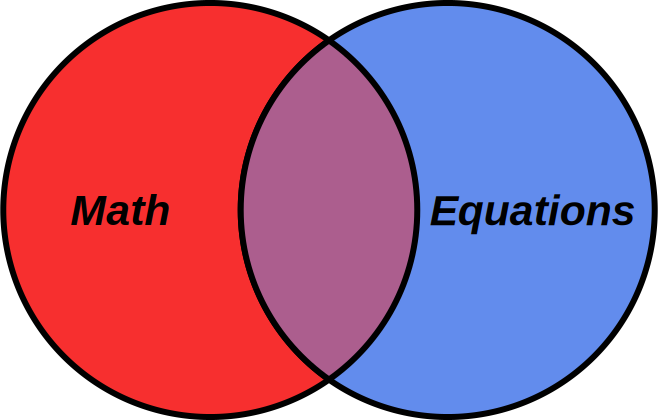

class: center, middle, inverse

# Equations in ebooks

ebookcraft 2018

Peter Krautzberger

[krautzource](https://www.krautzource.com)

---

# Introduction

"All Things Math On the Web"

* mathematician by training
* 2012-2017 MathJax Manager ([mathjax.org](https://www.mathjax.org))
* Since 2014 independent consultancy

<small>

[krautzource.com](https://www.krautzource.com/) | [peterkrautzberger.org](https://www.peterkrautzberger.org/)

[@pkrautz](https://twitter.com/pkrautz) |  [github.com/pkra](https://github.com/pkra) | [@pkra@mathstodon.xyz](https://mathstodon.xyz/@pkra) | [LinkedIn](https://www.linkedin.com/in/peter-krautzberger-6a54a445)

</small>

???
 * working primarily with STEM publishers
 * primarily on web-oriented production workflows
 * ebooks got me into this mess ;-)

---

# Overview

* Introduction (you're here!)
* Common equation *authoring* formats
  * A word on MathML
* Pros&Cons of equation *rendering* formats
  * Help you identify the best technology for specific content and/or platforms
* Conversion tools for the web and ebooks
  * visual and accessible rendering
  * equation rendering at scale
* Tips&Tricks
  * across ebook platforms
* A sample and tools to work with
---

# Equations ≠ Math

???
* words are important
* math is not equations
* neither includes the other
* equations are layout but also beyond math
* I do mostly math, so title is fitting
* still most of this talk will be about equations
* equations are layout

