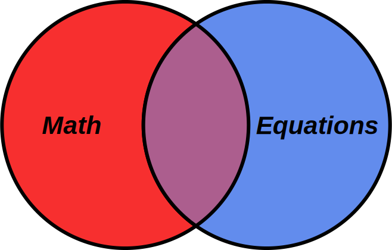

class: center, middle, inverse

# Equations in ebooks

ebookcraft 2018

Peter Krautzberger

[krautzource](https://www.krautzource.com)

---

# Introduction

"All Things Math On the Web"

* mathematician by training
* 2012-2017 MathJax Manager ([mathjax.org](https://www.mathjax.org))
* Since 2014 independent consultancy

<small>

[krautzource.com](https://www.krautzource.com/) | [peterkrautzberger.org](https://www.peterkrautzberger.org/)

[@pkrautz](https://twitter.com/pkrautz) |  [github.com/pkra](https://github.com/pkra) | [@pkra@mathstodon.xyz](https://mathstodon.xyz/@pkra) | [LinkedIn](https://www.linkedin.com/in/peter-krautzberger-6a54a445)

</small>

???
 * working primarily with STEM publishers
 * primarily on web-oriented production workflows
 * ebooks got me into this mess ;-)

---

# Today's Menu

* Common equation *authoring* formats
  * A word on MathML
* Pro&Con of equation *rendering* formats
  * How to identify the best technology given...
    * specific content
    * specific ebook platforms (e.g., Kindle, ADE, iBooks, Kobo, Google Play Books, Tolino, Bluefire)
* Conversion tools for the web and ebooks
  * visual and accessible rendering
  * equation rendering at scale
* Tips&Tricks
  * across ebook platforms
* A sample to work with

???

---

# Equations ≠ Math

???
* words are important
* math is not equations
* neither includes the other
* equations are layout but also beyond math
* I do mostly math, so title is fitting
* still most of this talk will be about equations
* equations are layout

---

# MathML and today's web

* MathML is dead. Long live MathML!
* Similarities and differences to sucessful web technologies.
* Making more out of MathML on the web

???

* 10 min
* MathML is effectively dead
  * Math WG dead
  * browser development by volunteers only and dead
  * MathML is used on the web only in combination with JS rendering engine
    * at most as accessibility alternative, with non-MathML visual rendering
  * => standard frozen. Bad for everyone.
    * eternal hope for the web is preventing the XML success of MathML to move forward
* similarities and differences
  * same: xml-ish
  * meh: MathML is like HTML 3 not HTML 5
    * no semantics
    * layout in markup (table/font/blink)
  * diff: content in attributes, operator dictionary
* make more of it on the web!
  * MathML a good basis for rendering for the web
    * much like print: choose an engine and go
  * HTML+CSS, SVG, even canvas
  * but MathML still provides a good vehicle for creating web content
    * converters to HTML or SVG grow continuously and become simpler
  * additional information can be passed from MathML to web output due to structural similarities
    * see a11y below

---

# Rendering equations on the web

* Rendering tools for & of the web
      * MathML: <a href="https://www.mathjax.org">MathJax</a>, <a href="https://mathscribe.com/author/jqmath.html">jqmath</a>, <a href="http://www.fmath.info/mathml.jsp">fmath</a>
      * Other: <a href="http://mathquill.com/">MathQuill</a>, <a href="http://mathlive.io/">mathlive</a>, <a href="https://khan.github.io/KaTeX/">KaTeX</a>
      * Proprietary: <a href="http://wiris.com/">WIRIS</a>, <a href="http://sharemath.com/">ShareMath</a>
      * Generic workflows
* Client vs server-side

> I'd just as soon kiss a Printer!

???

* tools and techniques for rendering mathematics in a web context
* 15 min
* MathML rendering tools
  * MathJax, jqmath, fmath
* other rendering tools
  * MathQuill, mathlive, KaTeX
* proprietary solutions (WIRIS, sharemath, )
* client vs server-side
  * go server for performance
  * add client for enhancements
* a word on web-based print (Antenna House, Prince, Vivliostyle)

---

# Accessible math on the web

* MathML and assistive technology
* (Non-)Interoparability with web accessibility
* 

  
Tools for equations+web accessibility

  Automated: <a href="https://github.com/zorkow/speech-rule-engine">Speech Rule Engine</a> (<a href="https://codepen.io/pkra/full/oWjwNM/">demo</a>) (also: proprietary solutions). 
  Manual: ARIA labels
  

* Other authoring formats and accessibility

???

* 10 min
* MathML and accessibility
  * understanding MathML's role
  * state of assistive technology for "plain" MathML
    * JAWS
    * VoiceOver
    * ChromeVox
    * MathPlayer
* interoperability with other standards (HTML, ARIA etc)
  * :-(
* tools for making math content accessible
  * automated (speech-rule-engine)
    * proprietary: Desmos, Khan Acadeym
  * manual (ARIA)

---

# Future(s) of math on the web

* Future of MathML
* Future of visual equation rendering
* Future of accessible equation rendering
* Future of mathematical content

???
* 10 min
* future of MathML
  * Part ways; deprecate from the web
  * Save it for XML and print - extend, clarify, fix
  * learn from what happens on the web
* future of equation rendering
  * CSS (variable fonts, grid, container queries)
  * Houdini (maybe)
  * web components (maybe)
* future of accessible rendering
  * ARIA all the things
  * AOM

